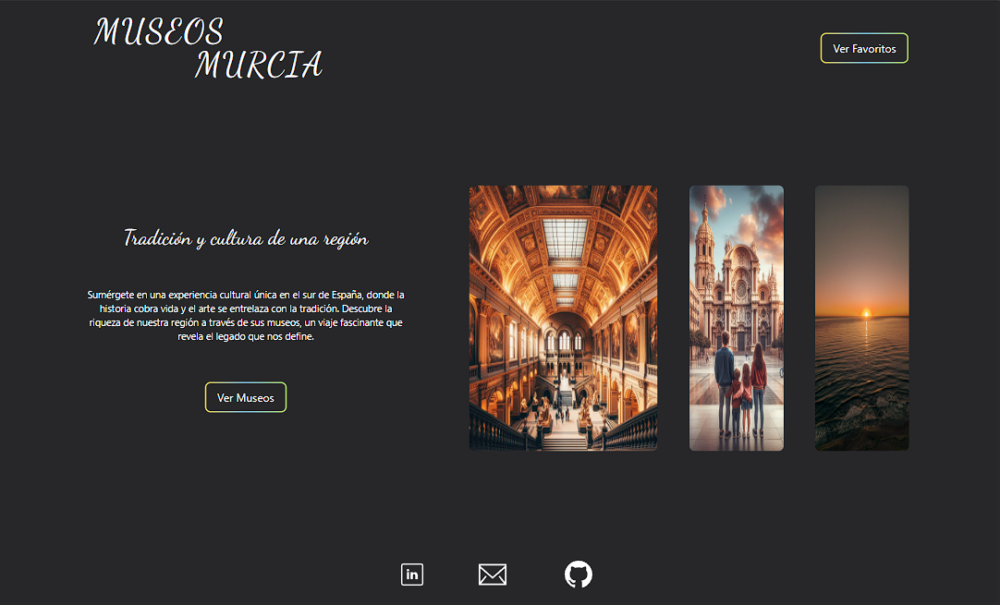
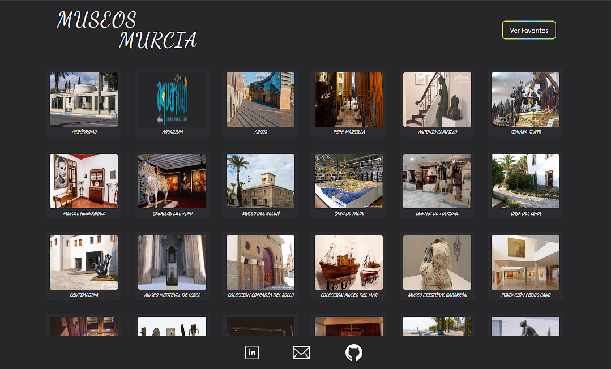
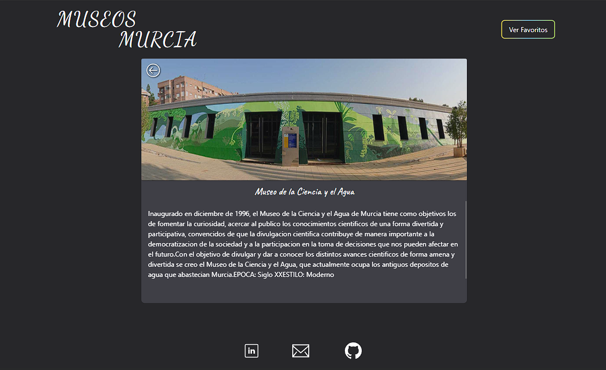

# Museos Murcia

## 👋 Bienvenido! 👋

😍 Gracias por visitar mi repositorio de Museos Murcia!

🛠 **Creado con React + Vite + Tailwind**

⚡ Proyecto totalmente "Responsive" con una interfaz minimalista y elegante.

1️⃣



2️⃣



3️⃣



<br/>

## Pasos para ejecutar el proyecto:

- Clonar el proyecto en tu máquina local

```batch
 git clone https://github.com/Rauljp16/Museos-Murcia.git
```

- Abrir el proyecto algún editor de código (Visual Studio Code, Sublime Text, etc)
- Instalr los paquetes de cada proyecto con

```batch
 npm install
```

- Inicializar el servidor de desarrollo

```batch
 npm run dev
```
